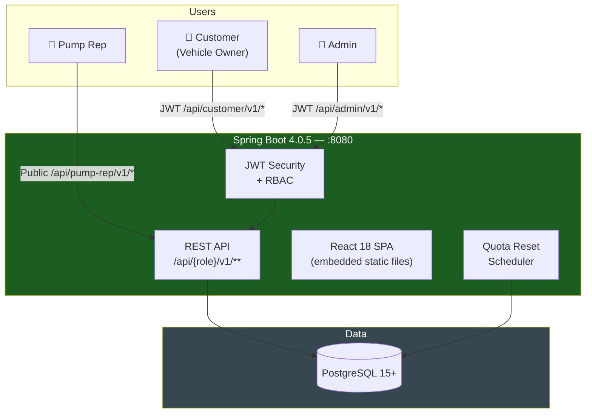

# Automated Fuel Quota System

> **Note:** This is an experimental, work-in-progress project. The entire codebase is AI-generated — produced by GitHub Copilot agents from high-level conceptual requirements, with no manual coding involved. 

[](https://www.gnu.org/licenses/agpl-3.0)
[](https://www.oracle.com/java/)
[](https://spring.io/projects/spring-boot)
[](https://react.dev)

> Fair, transparent fuel distribution through QR-code-driven quota management
>
> A complete fuel quota platform that combines customer convenience with administrative control, enabling vehicles to access their allocated fuel quota through secure QR code authorization at registered fuel stations.

---

## Overview

The **Automated Fuel Quota System** is a modern web application that manages fuel distribution for vehicles based on configurable quota policies. It enables vehicle owners and operators to generate secure QR codes for fuel authorization, while pump attendants scan these codes for quick authorization and dispensing. The system provides administrators with comprehensive dashboards to manage quotas, track transactions, and enforce fair fuel allocation.

**Key Use Cases:**
- **Vehicle owners** register their vehicles and generate secure, time-limited QR codes for fuel authorization
- **Pump representatives** use a browser-based portal to scan QR codes (or manually enter registration numbers) and dispense fuel with instant quota validation
- **Administrators** manage fuel stations, configure quota policies, adjust individual quotas, and view detailed transaction history and analytics
- **Drivers** can be assigned to vehicles and generate QR codes independently for fuel refueling

---

## 🚀 Key Features

### For Vehicle Owners
- **Flexible Registration** - Register as a vehicle owner or driver-only (with optional vehicles)
- **Multi-Vehicle Management** - Manage multiple registered vehicles with individual quota tracking
- **Driver Assignment** - Authorize trusted drivers to generate QR codes for your vehicles
- **QR Code Generation** - Create secure, time-limited QR codes for fuel authorization
- **Primary & Secondary Fuel Types** - Support for multiple fuel types (petrol, diesel, CNG) with fuel-type-specific QR codes
- **Quota Dashboard** - Visual display of fuel usage and remaining quota with transaction history
- **Transaction Records** - Complete history of fuel dispensing activities with vehicle filtering

### For Pump Representatives
- **Browser-Based Portal** - Mobile-optimized pump rep portal with no installation required
- **Quick QR Scanning** - Camera-based QR code scanning for rapid authorization
- **Manual Fallback** - Enter vehicle registration number directly when QR scanning is unavailable
- **Real-Time Validation** - Instant verification of vehicle eligibility and quota availability
- **Mobile-Friendly Interface** - Numeric keypad and optimized layout for touch interaction
- **Transaction Receipts** - Confirmation with reference number, amount dispensed, and remaining quota

### For Administrators
- **Dashboard Analytics** - Overview of system metrics, active vehicles, transaction volume, and quota utilization
- **User Management** - Manage customer and admin accounts with suspend/activate functionality
- **Vehicle Approvals** - Monitor vehicle registrations with BRTA verification status
- **Fuel Station Network** - Add, configure, and manage fuel stations with GPS coordinates
- **Quota Configuration** - Set global defaults, create quota sets for registration codes, and override individual quotas
- **Bulk Operations** - Sync quota configurations to multiple vehicles with one action
- **Pump Rep Management** - Create and manage pump representative accounts
- **Audit Trail** - Comprehensive logging of all administrative actions and system events

---

## Getting Started

### For Users
1. Visit the landing page and choose your role (vehicle owner or pump representative)
2. **Vehicle Owners**: Register your account, add your vehicle, and generate a QR code
3. **Pump Reps**: Login with your employee ID to access the scanning portal
4. **Admins**: Login with admin credentials to access management dashboards

### For Developers & Contributors
1. **Clone the repository**
   ```bash
   git clone https://github.com/eendroroy/automated-fuel-quota.git
   cd automated-fuel-quota
   ```

2. **System Requirements**
   - Java 25 or compatible JDK
   - Node.js 20+ and npm
   - PostgreSQL 15+
   - Maven 3.9+

3. **Setup & Development**
   - See `documentation/SRS.md` for detailed setup instructions
   - Frontend development: `cd frontend && npm run dev`
   - Backend development: `./mvnw spring-boot:run`

4. **Building for Production**
   ```bash
   ./mvnw clean package
   ```

---

## How to Use

### Vehicle Owners: Get Fuel
1. Register on the platform with your personal details
2. Add your vehicle(s) and receive automatic BRTA verification
3. Generate a QR code in the app (select fuel type if needed)
4. Visit any registered fuel station and show the QR code
5. Pump attendant scans and confirms the amount
6. Receive confirmation with remaining quota

### Pump Representatives: Dispense Fuel
1. Login with your employee ID
2. Scan the customer's QR code OR manually enter registration number
3. Verify vehicle details and quota availability
4. Enter the fuel amount (system suggests available quota)
5. Confirm transaction
6. Provide receipt to customer

### Administrators: Manage the System
1. **Monitor**: View dashboard with active users, vehicles, and transactions
2. **Configure**: Set up fuel stations and quota policies (daily, weekly, monthly, etc.)
3. **Manage**: Create pump rep accounts, adjust individual quotas, manage users
4. **Analyze**: Review audit logs and transaction history for compliance

---

## What to Do Next

### I Want to...

- **Learn about the system** → Read [`documentation/BRD.md`](documentation/BRD.md) for business requirements
- **Understand the technical architecture** → Check [`documentation/SRS.md`](documentation/SRS.md)
- **See user flows** → Visit [`documentation/USER_JOURNEY.md`](documentation/USER_JOURNEY.md)
- **Set up for development** → See setup instructions in the SRS document
- **Contribute code** → Open an issue or pull request following the contribution guidelines
- **Report a bug** → Create an issue with clear reproduction steps
- **Suggest a feature** → Start a discussion in the issues section

### Find Help

- **Documentation** - See the `documentation/` folder for detailed guides
- **Issues** - Search existing issues or create a new one
- **Discussions** - Join the conversation in project discussions
- **Code Examples** - Check user journey maps for step-by-step flows

---

## Project Status

**Status:** ✅ **Active & Maintained**

This is a production-ready fuel quota management system with:
- ✅ Complete implementation of all business requirements
- ✅ Comprehensive test coverage
- ✅ Security features (JWT, RBAC, audit logging)
- ✅ Performance optimization and monitoring
- ✅ Multi-language support (English & Bangla)
- ✅ Mobile optimization for pump portal

### Maintenance Commitment
- Regular security updates and dependency management
- Bug fixes and performance improvements
- Feature enhancements based on user feedback
- Documentation updates with each release

---

## Contributing

We welcome contributions! Whether you're fixing bugs, adding features, or improving documentation:

1. **Fork** the repository
2. **Create a feature branch** (`git checkout -b feature/amazing-feature`)
3. **Make your changes** with clear commit messages
4. **Write or update tests** for your changes
5. **Submit a Pull Request** with a detailed description

### Development Guidelines
- Follow existing code style and patterns
- Add tests for new functionality
- Update documentation as needed
- Ensure all tests pass before submitting PR

For more details, see `documentation/SRS.md` and the contributing guide in the repository.

---

## License

This project is licensed under the **GNU Affero General Public License v3.0 (AGPL-3.0)** — a free, copyleft license that ensures the software remains free and open-source.

**Key Points:**
- ✅ You can use, modify, and distribute the software freely
- ✅ If you run a modified version as a network service, you must provide access to the source code
- ✅ All modifications must be released under the same AGPL-3.0 license
- 📄 Full license text available in the [`LICENSE`](LICENSE) file

For more information, visit: https://www.gnu.org/licenses/agpl-3.0.html

---

## Links & Contacts

- **GitHub Repository** - https://github.com/eendroroy/automated-fuel-quota
- **Project Issues** - https://github.com/eendroroy/automated-fuel-quota/issues
- **Documentation** - See `documentation/` folder in repository
- **Author** - [@eendroroy](https://github.com/eendroroy)

---

## Additional Resources

---

## Technical Architecture

### System Design




### Implementation Highlights

This project implements all business requirements with:
- **Complete Backend** - Spring Boot REST API with security and scheduling
- **Frontend Application** - React SPA with customer, admin, and pump representative portals
- **Database** - PostgreSQL with optimized schema and indexes
- **Security** - JWT authentication, role-based access control, and audit logging
- **Advanced Features** - Quota config sets, bulk operations, automatic BRTA verification, driver assignment
- **Mobile Support** - Responsive design optimized for pump rep QR scanning portal

## Documentation

Complete technical documentation is available in the `documentation/` folder:

| Document | Purpose |
|----------|---------|
| [BRD.md](documentation/BRD.md) | **Business Requirements Document** - Detailed requirements, business rules, and acceptance criteria |
| [SRS.md](documentation/SRS.md) | **Software Requirements Specification** - Technical architecture, API contracts, entity schemas, and setup guide |
| [USER_JOURNEY.md](documentation/USER_JOURNEY.md) | **User Journey Maps** - Step-by-step flows for vehicle owners, pump representatives, and administrators |

---

## Technology Stack

**Backend:** Spring Boot 4.0.5 | Java 25 | Spring Security | Spring Data JPA | PostgreSQL 15+

**Frontend:** React 18 | TypeScript | Vite | Tailwind CSS | Axios

**DevOps:** Maven | Docker | npm

---

**Questions?** Check the [documentation](documentation/) folder or open an issue on GitHub.

