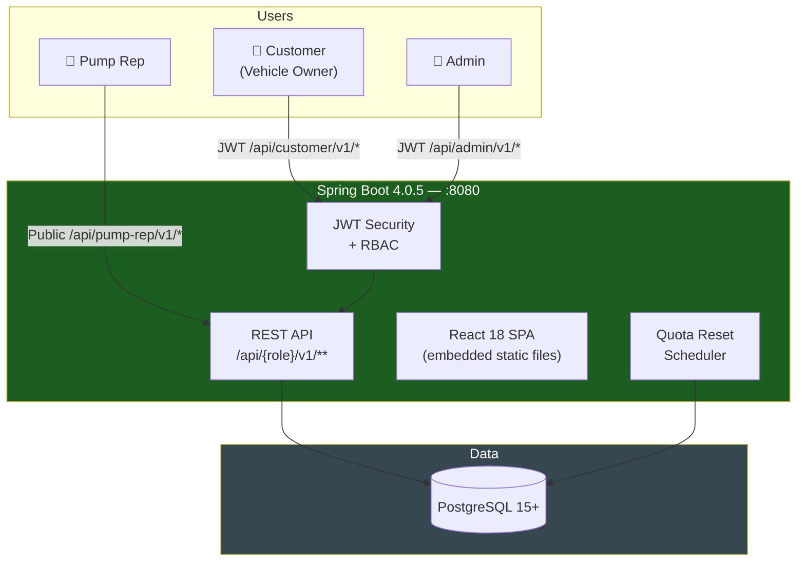

# Automated Fuel Quota System

A comprehensive **QR-code-driven fuel quota management platform** built with **Spring Boot 4.0.5** and **React 18** that ensures fair, transparent fuel distribution based on a configurable weekly quota policy.

> **📄 Documentation:**
> [`documentation/BRD.md`](documentation/BRD.md) (requirements) |
> [`documentation/SRS.md`](documentation/SRS.md) (technical spec) |
> [`documentation/USER_JOURNEY.md`](documentation/USER_JOURNEY.md) (user journeys)

---

## 🏗️ System Architecture




### Complete Implementation Status ✅

This project is a **fully functional** fuel quota management system implementing all BRD requirements plus additional features:

- ✅ **Backend API** - Complete Spring Boot application with security and scheduling
- ✅ **Frontend SPA** - React/TypeScript customer and admin portals
- ✅ **Pump Rep Web Portal** - Browser-based portal for pump representatives with QR scanning and manual lookup
- ✅ **Database Schema** - PostgreSQL with proper relationships and indexes
- ✅ **Business Logic** - Configurable quota management with partial dispense support
- ✅ **Security** - JWT authentication with role-based access control
- ✅ **Scheduled Jobs** - Automatic quota reset based on configurable period
- ✅ **Driver-Only Registration** - Users can register without owning vehicles
- ✅ **Quota Config Sets** - Group multiple registration codes into shared quota sets (e.g. GA/KHA/BHA → 30L/week)
- ✅ **Bulk Quota Sync** - Push config-set limits to all non-individually-overridden vehicles with one action
- ✅ **Custom Quota Marker** - Vehicles with admin-overridden quotas are visually flagged and excluded from sync
- ✅ **Driver Assignment** - Vehicle owners can assign drivers with full authorization

### Core Business Logic (Per BRD Requirements)

- ✅ **Configurable Quota** - Flexible limit enforcement per vehicle (default 24L weekly)
- ✅ **Quota Config Sets** - Group vehicle registration codes (GA, KHA, BHA…) into named sets with a shared limit and period
- ✅ **Custom Quota Override** - Admin can individually adjust a vehicle's limit; it is then excluded from bulk sync operations
- ✅ **QR Code Authentication** - Encrypted JWT tokens with 1-hour expiration
- ✅ **GPS Geofencing** - Location-based validation for authorized stations
- ✅ **Partial Dispense Support** - Smart authorization when requested > remaining quota
- ✅ **Configurable Period Reset** - Scheduled quota restoration (DAILY/WEEKLY/MONTHLY/QUARTERLY/YEARLY)
- ✅ **Real-time Validation** - Instant vehicle status and quota checking
- ✅ **Idempotent Transactions** - Prevents double-deducting from quota on QR path
- ✅ **Complete Audit Trail** - Every action logged with timestamp and user

## 🚀 Key Features

### Vehicle Owner App (Customer Portal)
- **Flexible Registration** - Register as vehicle owner OR driver-only account (optional vehicle)
- **Multi-step Registration** - Personal info → Vehicle details (optional) → Review & submit
- **QR Code Management** - Generate, regenerate, and download fuel QR codes  
- **Driver Management** - Assign registered drivers to vehicles; both owner and driver can generate QR codes
- **Quota Dashboard** - Visual gauge showing used vs. remaining fuel allocation
- **Transaction History** - Complete record of fuel dispensing activities
- **Vehicle Ownership Claims** - Submit and track ownership transfer requests
- **Vehicles as Driver** - View and manage vehicles where user is assigned as driver

### Admin Dashboard
- **Vehicle Management** - Approve, reject, or suspend vehicle registrations
- **Fuel Station Management** - CRUD operations with GPS coordinate validation
- **Quota Administration** - Adjust limits, manual resets, and bulk operations
- **Quota Config Sets** - Create named sets grouping multiple registration codes with a shared fuel limit and period
- **Bulk Quota Sync** - One-click sync of config-set limits to all eligible vehicles (skips individually overridden quotas)
- **Analytics & Reporting** - Usage charts, transaction trends, and system metrics
- **Audit Log Viewer** - Searchable, filterable administrative action history

### Pump Representative Web Portal (`/pump`)
- **Employee ID Login** - Authenticate with employee code; station info shown after login
- **QR Code Scanner** - Camera-based scanning via `html5-qrcode` library
- **Manual Fallback** - Enter vehicle registration number directly when QR is unavailable
- **Vehicle Verification Panel** - Shows registration number, BRTA status badge, owner name, vehicle make/color
- **Quota Progress Bar** - Color-coded remaining/total quota display (green → yellow → red)
- **On-screen Numeric Keypad** - Mobile-friendly fuel amount entry (4 digits + 2 decimals)
- **Fuel Type Selector** - Dropdown pre-populated from vehicle's registered fuel type
- **Transaction Receipt** - Reference number, dispensed amount, and remaining quota shown after confirmation

## 🛠️ Technology Stack

### Backend
- **Spring Boot 4.0.5** with Java 25
- **Spring Security** with JWT authentication
- **Spring Data JPA** with PostgreSQL
- **Spring Scheduler** for quota reset jobs
- **Bean Validation** for request validation

### Frontend
- **React 18** with TypeScript
- **Vite** for build tooling and HMR
- **Tailwind CSS** for responsive styling
- **React Router v6** for client-side routing
- **Axios** for API communication
- **React QR Code** for QR generation (customer portal)
- **html5-qrcode** for QR scanning (pump rep portal)
- **Recharts** for admin analytics

### Infrastructure
- **PostgreSQL 15+** - Primary database
- **Maven** - Java dependency management
- **npm** - Node.js package management

## 📋 Quick Start

> For complete user journey maps, see [`documentation/USER_JOURNEY.md`](documentation/USER_JOURNEY.md).

### Prerequisites
- Java 25 (or compatible JDK)
- Node.js 20+ and npm
- PostgreSQL 15+
- Maven 3.9+

### 1. Database Setup

```sql
CREATE DATABASE automated_fuel_quota;
CREATE USER fuel_user WITH PASSWORD 'fuel_password';
GRANT ALL PRIVILEGES ON DATABASE automated_fuel_quota TO fuel_user;
```

### 2. Configure Application

Update `src/main/resources/application.yaml`:

```yaml
spring:
  datasource:
    url: jdbc:postgresql://localhost:5432/automated_fuel_quota
    username: fuel_user
    password: fuel_password
```

### 3. Run the Application

```bash
# Build and run the complete application
./mvnw clean install
./mvnw spring-boot:run

# Access the application
# Frontend: http://localhost:8080
# API: http://localhost:8080/api
```

### 4. Default Login Credentials

**Admin Portal**: http://localhost:8080/admin/login
- Email: `admin@fuelquota.gov`
- Password: `admin123`

**Customer Registration**: http://localhost:8080/register
- Register new vehicle owners through the self-service portal

**Pump Representative Portal**: http://localhost:8080/pump
- Enter the employee ID of any active pump representative (created via Admin → Pump Reps)

## 🔧 API Endpoints

All REST endpoints are versioned under `/api/{role}/v1/`.

### Authentication
```
POST /api/auth/v1/customer/login     - Customer login
POST /api/auth/v1/admin/login        - Admin login
POST /api/auth/v1/customer/register  - Vehicle registration
POST /api/auth/v1/customer/send-otp  - Send OTP for mobile verification
```

### Customer API (`/api/customer/v1/`, JWT Required)
```
GET    /api/customer/v1/vehicles                       - List own vehicles
POST   /api/customer/v1/vehicles                       - Add new vehicle
GET    /api/customer/v1/vehicles-as-driver             - List vehicles where user is driver
POST   /api/customer/v1/vehicles/{id}/driver           - Assign driver to vehicle
DELETE /api/customer/v1/vehicles/{id}/driver           - Remove driver from vehicle
GET    /api/customer/v1/quota                          - Get quota status
GET    /api/customer/v1/vehicles/{id}/qr-code          - Generate QR token for vehicle
POST   /api/customer/v1/vehicles/{id}/qr-code/regenerate - Regenerate QR
GET    /api/customer/v1/transactions                   - Transaction history
POST   /api/customer/v1/vehicles/claim                 - Submit ownership claim
GET    /api/customer/v1/vehicles/claims                - List own claims
```

### Pump Representative API (`/api/pump-rep/v1/`, Public — Core BRD)
```
POST /api/pump-rep/v1/login              - Employee ID login → session details ⭐
POST /api/pump-rep/v1/authorize          - Authorize via QR token ⭐
POST /api/pump-rep/v1/authorize-manual   - Authorize via registration number ⭐
POST /api/pump-rep/v1/confirm            - Confirm fuel dispensed ⭐
```

### Admin API (`/api/admin/v1/`, JWT + Admin Role Required)
```
GET    /api/admin/v1/stats                        - Dashboard statistics
GET    /api/admin/v1/vehicles                     - List vehicles (paginated)
PUT    /api/admin/v1/vehicles/{id}/reverify        - Re-verify vehicle
GET    /api/admin/v1/vehicle-claims               - List ownership claims
PUT    /api/admin/v1/vehicle-claims/{id}/approve  - Approve claim
PUT    /api/admin/v1/vehicle-claims/{id}/reject   - Reject claim
GET    /api/admin/v1/stations                     - List fuel stations
POST   /api/admin/v1/stations                     - Create station
PUT    /api/admin/v1/stations/{id}                - Update station
DELETE /api/admin/v1/stations/{id}                - Delete station
GET    /api/admin/v1/pump-representatives         - List pump reps
POST   /api/admin/v1/pump-representatives         - Create pump rep
PUT    /api/admin/v1/pump-representatives/{id}    - Update pump rep
GET    /api/admin/v1/quotas                       - List all quotas (paginated)
PUT    /api/admin/v1/quotas/{vehicleId}/adjust    - Adjust individual quota (marks as overridden)
POST   /api/admin/v1/quotas/{vehicleId}/reset     - Reset individual quota
POST   /api/admin/v1/quotas/bulk-reset            - Bulk reset all quotas
GET    /api/admin/v1/quota-config                 - Get global quota configuration
PUT    /api/admin/v1/quota-config                 - Update global quota configuration
GET    /api/admin/v1/quota-config-sets            - List all quota config sets
POST   /api/admin/v1/quota-config-sets            - Create quota config set
PUT    /api/admin/v1/quota-config-sets/{id}       - Update quota config set
DELETE /api/admin/v1/quota-config-sets/{id}       - Delete quota config set
POST   /api/admin/v1/quota-config/sync            - Sync config set limits to vehicles
GET    /api/admin/v1/audit-logs                   - Audit log (paginated)
GET    /api/admin/v1/transactions                 - All transactions (paginated)
```

### Public Reference Data (`/api/public/v1/`, No Auth)
```
GET /api/public/v1/registration-codes  - Vehicle registration codes
GET /api/public/v1/brta-offices        - BRTA regional office codes
```

## 🔄 Core Business Process Flow

### 1. Vehicle Registration & Approval
```
Customer Registration → Auto-VERIFIED → Quota Created → QR Code Ready
```

### 2. Fuel Dispensing — QR Path (Primary)
```
Rep Login (employee ID) → QR Code Scan → Token Validation →
Vehicle Verification → Geofence Check → Quota Authorization →
Enter Amount (numeric keypad) → Confirm → Transaction Recorded → Receipt
```

### 3. Fuel Dispensing — Manual Path (Fallback)
```
Rep Login (employee ID) → Enter Registration Number → Vehicle Lookup →
Vehicle Verification → Quota Authorization →
Enter Amount (numeric keypad) → Confirm → Transaction Recorded → Receipt
```

### 4. Weekly Quota Reset (Automated)
```
Sunday 00:00 Trigger → Reset All Quotas →
Audit Logging → System Ready for New Week
```

## 📊 System Capabilities

### Performance Targets
- **Authorization Response Time**: < 2 seconds
- **Concurrent Users**: 10,000+
- **Transaction Throughput**: 1000+ TPS
- **System Uptime**: 99.9%
- **Weekly Reset Success**: 100%

### Security Features  
- ✅ HTTPS/TLS encryption required
- ✅ JWT tokens with secure 256-bit secrets
- ✅ QR tokens expire after 1 hour
- ✅ SQL injection prevention via JPA
- ✅ Input validation on all endpoints
- ✅ Role-based access control
- ✅ Complete audit logging

### Monitoring & Observability
- **Spring Boot Actuator** - Health checks and metrics
- **Centralized Logging** - Structured application logs  
- **Database Monitoring** - Connection pool and query performance

## 🧪 Testing

```bash
# Run all tests
./mvnw test

# Run integration tests  
./mvnw verify

# Frontend tests
cd frontend && npm test
```

## 🏭 Production Deployment

The application is containerizable and cloud-ready:

```bash
# Build production build
./mvnw clean package -Pprod

# Frontend production build (embedded in Spring Boot)
cd frontend && npm run copy-to-static

# Run production JAR
java -jar target/automated-fuel-quota-0.0.1-SNAPSHOT.jar
```

## 📚 Project Structure

```
automated-fuel-quota/
├── documentation/
│   ├── BRD.md                    # Business Requirements Document
│   ├── SRS.md                    # Software Requirements Specification
│   └── USER_JOURNEY.md           # User journey maps (all actor types)
├── src/main/java/io/github/eendroroy/fuelquota/
│   ├── config/          # Security, OpenAPI, DataInitializer
│   ├── controller/
│   │   └── v1/
│   │       ├── admin/   # V1AdminDashboardController, V1AdminVehicleController,
│   │       │            # V1AdminQuotaController, V1AdminStationController,
│   │       │            # V1AdminPumpRepController, V1AdminAuditController,
│   │       │            # V1AdminTransactionController
│   │       ├── customer/ # V1CustomerController
│   │       ├── pump/     # V1PumpRepController
│   │       ├── auth/     # V1AuthController
│   │       └── pub/      # V1ReferenceDataController
│   ├── dto/             # Request/Response DTOs (incl. QuotaConfigSetRequest/Response)
│   ├── entity/          # JPA entities (incl. QuotaConfigSet, Quota.individuallyOverridden)
│   ├── enums/           # Domain enumerations
│   ├── exception/       # Global exception handling
│   ├── repository/      # JPA repositories
│   ├── security/        # JWT provider and filter
│   └── service/         # Business logic (incl. QuotaConfigSetService, QuotaService.syncQuotaConfigs)
├── src/main/resources/
│   ├── application.yaml # Application configuration
│   └── static/          # Frontend build output (served by Spring Boot)
├── frontend/            # React 18 / TypeScript SPA
│   └── src/
│       ├── api/         # Versioned Axios API clients
│       │   ├── authApi.ts            # /auth/v1/**
│       │   ├── vehicleApi.ts         # /customer/v1/**, /admin/v1/vehicles/**
│       │   ├── quotaApi.ts           # /customer/v1/quota, /admin/v1/quotas/**
│       │   ├── quotaConfigApi.ts     # /admin/v1/quota-config, /quota-config-sets/**, sync
│       │   ├── stationApi.ts         # /admin/v1/stations/**
│       │   ├── pumpApi.ts            # /pump-rep/v1/**
│       │   └── ...
│       ├── components/  # Reusable UI components
│       ├── layouts/     # PublicLayout, CustomerLayout, AdminLayout, PumpRepLayout
│       ├── pages/
│       │   ├── customer/    # Customer portal pages
│       │   ├── admin/       # Admin portal pages (incl. unified AdminQuotaConfigPage)
│       │   └── pump/        # Pump rep portal (Login, Scan, Dispense)
│       └── types/           # Shared TypeScript interfaces
└── AGENTS.md            # AI coding agent guide
```

## 🎯 Implementation Highlights

This implementation fully satisfies all **Business Requirements Document (BRD)** specifications:

### Functional Requirements Implemented ✅
- **FR-01 through FR-10** — All vehicle owner portal requirements
- **FR-11 through FR-20** — Full pump representative web portal (login, scan, manual entry, dispense, receipt)
- **FR-21 through FR-30** — Complete admin portal
- **FR-31 through FR-33** — Backend infrastructure (scheduler, transactions, audit)

### Non-Functional Requirements Met ✅
- **NFR-01 through NFR-13** — Security, performance, reliability, and observability

### Business Rules Enforced ✅
- **BR-1 through BR-9** — Weekly quota limits, partial dispense, automatic reset, eligibility checks, pump rep login, manual authorization

---

**🎉 Ready for Production Use** - Complete fuel quota management system implementing all BRD requirements with modern technology stack and best practices.

---

## 📖 Documentation Index

| Document | Description |
|----------|-------------|
| [`documentation/BRD.md`](documentation/BRD.md) | Business Requirements Document — requirements, rules, acceptance tests |
| [`documentation/SRS.md`](documentation/SRS.md) | Software Requirements Specification — API contracts, entity schemas |
| [`documentation/USER_JOURNEY.md`](documentation/USER_JOURNEY.md) | Detailed user journey maps for Customer, Pump Rep, Admin, and System |
| [`AGENTS.md`](AGENTS.md) | AI coding agent guide — patterns, conventions, and domain model |

