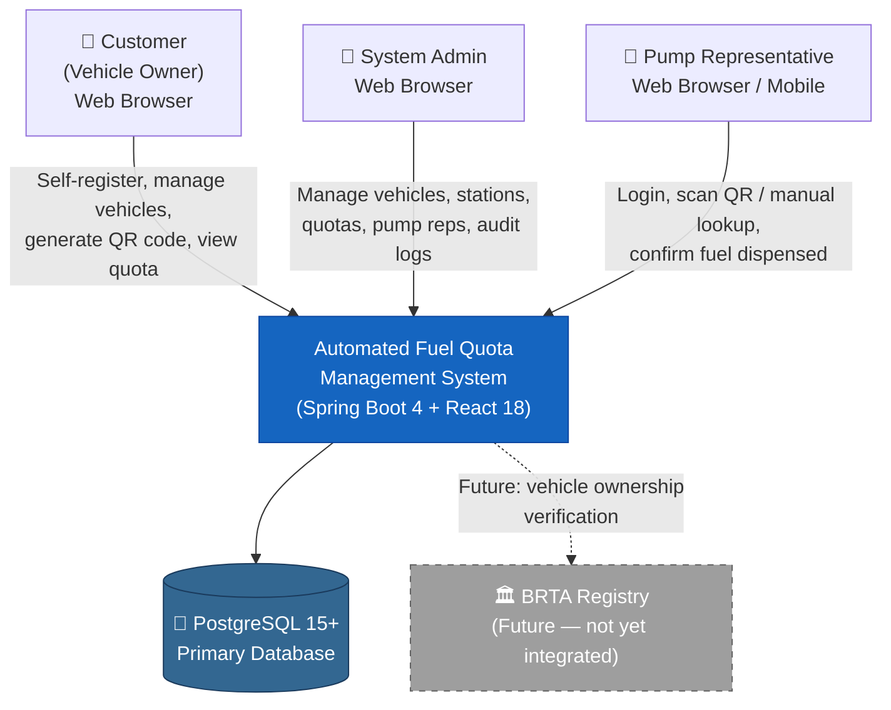
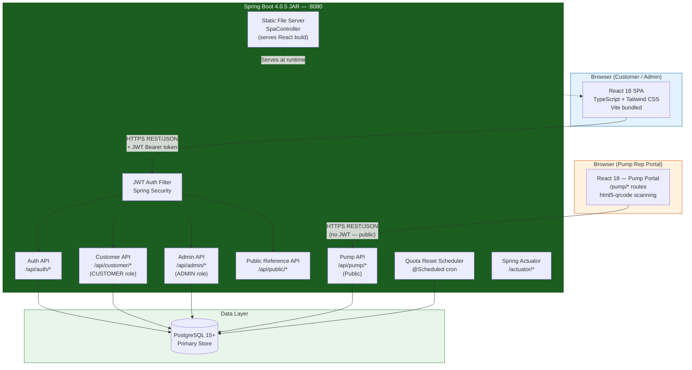
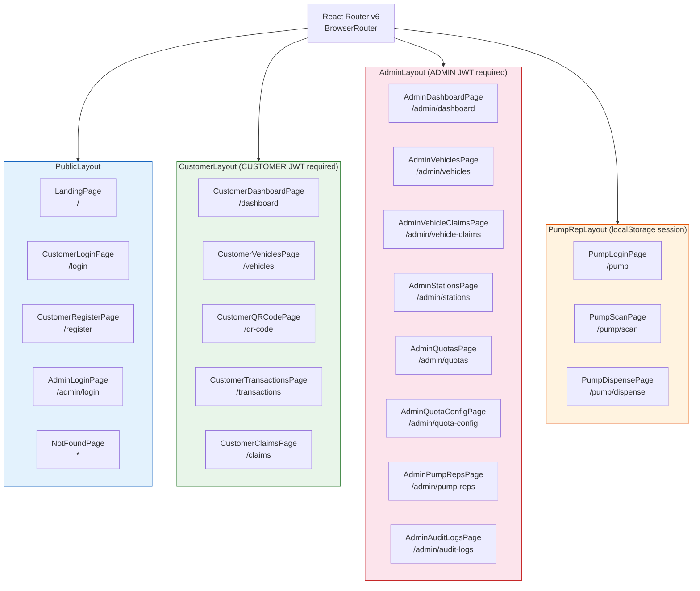

# System Architecture

## Level 1 — System Context

> Who uses the system and what external systems does it interact with?

---

## Level 2 — Container Diagram

> What are the major deployable units and how do they communicate?

---

## Level 3 — Backend Component Diagram

> What are the internal components of the Spring Boot application?

```mermaid
graph TD
    subgraph Controllers["Controllers Layer (REST)"]
        AuthC["AuthController<br/>/api/auth/*"]
        CustomerC["CustomerController<br/>/api/customer/*"]
        AdminC["AdminController<br/>/api/admin/*"]
        PumpC["PumpController<br/>/api/pump/*"]
        RefC["ReferenceDataController<br/>/api/public/*"]
        SpaC["SpaController<br/>/** (SPA fallback)"]
    end

    subgraph Services["Service Layer (Business Logic)"]
        AuthSvc["AuthService<br/>Registration / Login / JWT"]
        CustomerSvc["CustomerService<br/>Vehicle + QR management"]
        VehicleSvc["VehicleService<br/>Vehicle CRUD + BRTA"]
        QuotaSvc["QuotaService<br/>Quota calc + reset scheduler"]
        PumpSvc["PumpService<br/>QR/manual auth + confirm"]
        StationSvc["FuelStationService<br/>Station CRUD"]
        RepSvc["PumpRepresentativeService<br/>Rep CRUD + login"]
        ClaimSvc["VehicleClaimService<br/>Claim workflow"]
        AuditSvc["AuditLogService<br/>Immutable audit trail"]
        StatsSvc["AdminStatsService<br/>Dashboard analytics"]
        QuotaCfgSvc["QuotaConfigService<br/>Global config CRUD"]
    end

    subgraph Security["Security Layer"]
        JwtProvider["JwtTokenProvider<br/>Sign / Validate tokens"]
        JwtFilter["JwtAuthFilter<br/>Inject userId/role into request"]
        SecurityCfg["SecurityConfig<br/>CORS / CSRF / route rules"]
    end

    subgraph Repositories["Repository Layer (Spring Data JPA)"]
        UserRepo["UserRepository"]
        VehicleRepo["VehicleRepository"]
        QuotaRepo["QuotaRepository<br/>(bulk reset query)"]
        TxRepo["TransactionRepository"]
        StationRepo["FuelStationRepository"]
        RepRepo["PumpRepresentativeRepository"]
        ClaimRepo["VehicleClaimRepository"]
        AuditRepo["AuditLogRepository"]
        QuotaCfgRepo["QuotaConfigRepository"]
    end

    subgraph External["External / Infrastructure"]
        PG[("PostgreSQL")]
    end

    AuthC --> AuthSvc
    CustomerC --> CustomerSvc
    CustomerC --> VehicleSvc
    AdminC --> VehicleSvc
    AdminC --> StationSvc
    AdminC --> RepSvc
    AdminC --> QuotaSvc
    AdminC --> ClaimSvc
    AdminC --> AuditSvc
    AdminC --> StatsSvc
    AdminC --> QuotaCfgSvc
    PumpC --> PumpSvc
    PumpC --> RepSvc
    RefC --> VehicleSvc

    AuthSvc --> JwtProvider
    AuthSvc --> UserRepo
    AuthSvc --> VehicleRepo
    AuthSvc --> QuotaSvc
    CustomerSvc --> VehicleRepo
    CustomerSvc --> JwtProvider
    PumpSvc --> JwtProvider
    PumpSvc --> VehicleRepo
    PumpSvc --> QuotaSvc
    PumpSvc --> TxRepo
    QuotaSvc --> QuotaRepo

    QuotaRepo --> PG
    VehicleRepo --> PG
    UserRepo --> PG
    TxRepo --> PG
    StationRepo --> PG
    RepRepo --> PG
    ClaimRepo --> PG
    AuditRepo --> PG
    QuotaCfgRepo --> PG

    JwtFilter --> JwtProvider
    SecurityCfg --> JwtFilter

    style Controllers fill:#1565c0,color:#fff
    style Services fill:#1b5e20,color:#fff
    style Security fill:#4a148c,color:#fff
    style Repositories fill:#e65100,color:#fff
    style External fill:#37474f,color:#fff
```

---

## Level 3 — Frontend Component Architecture

> How is the React SPA structured?

