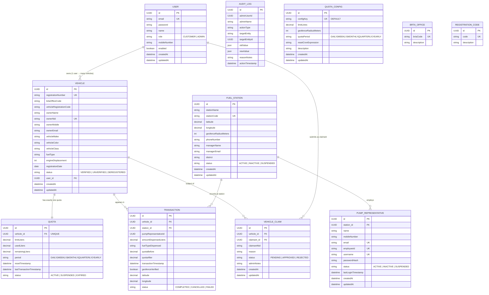

# Entity Relationship Diagram

> Complete database schema with all entities, fields, and relationships for the Automated Fuel Quota Management System.



---

## Key Constraints

| Entity | Field | Constraint | Notes |
|--------|-------|-----------|-------|
| `USER` | `email` | UNIQUE | Login identifier |
| `VEHICLE` | `registrationNumber` | UNIQUE | Assembled from 4 BRTA components |
| `VEHICLE` | `ownerNid` | UNIQUE | One vehicle per NID (implicit) |
| `QUOTA` | `vehicle_id` | UNIQUE | One quota record per vehicle |
| `FUEL_STATION` | `stationCode` | UNIQUE | System station identifier |
| `PUMP_REPRESENTATIVE` | `email` | UNIQUE | Work email |
| `PUMP_REPRESENTATIVE` | `employeeId` | UNIQUE | Printed on ID card, used for login |
| `PUMP_REPRESENTATIVE` | `username` | UNIQUE | Pump app login handle |
| `QUOTA_CONFIG` | `configKey` | UNIQUE | Singleton `"DEFAULT"` row |

---

## Registration Number Format

A vehicle registration number is assembled from 4 structured parts:

```
{brtaOfficeCode} {vehicleRegistrationCode} {serialPart1}-{serialPart2}

Example: DHAKA METRO GA 11-1234
         ─────────── ── ──────
         Office Code RC Serial
```

- **BRTA Office Codes** are reference data from the `BRTA_OFFICE` table.
- **Registration Codes** (e.g. `GA`, `KHA`) are reference data from the `REGISTRATION_CODE` table.

---

## Quota Calculation

```
remainingLiters = limitLiters - usedLiters

On dispense:  usedLiters    += dispensedLiters
              remainingLiters -= dispensedLiters

On reset:     usedLiters     = 0
              remainingLiters = limitLiters
```

