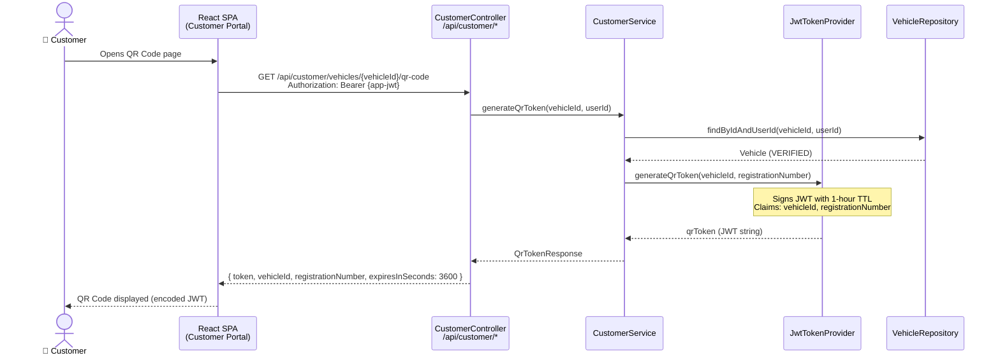
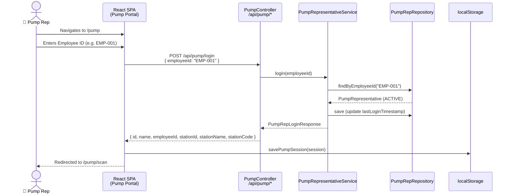
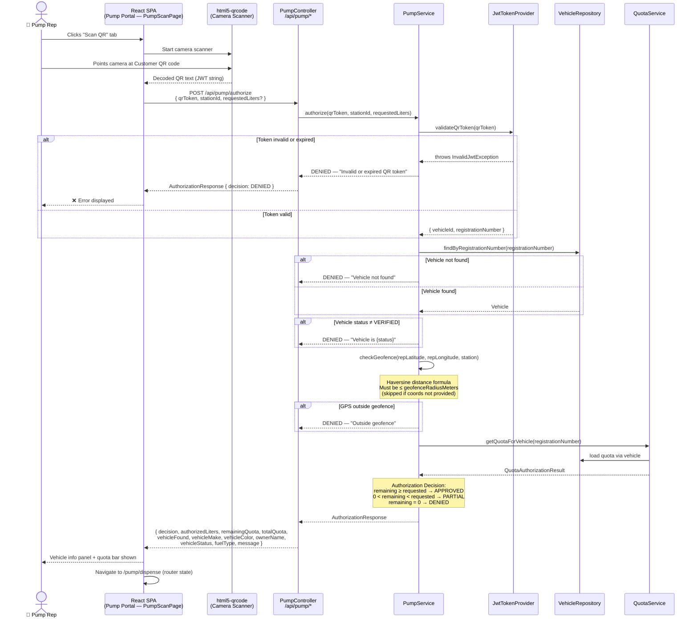
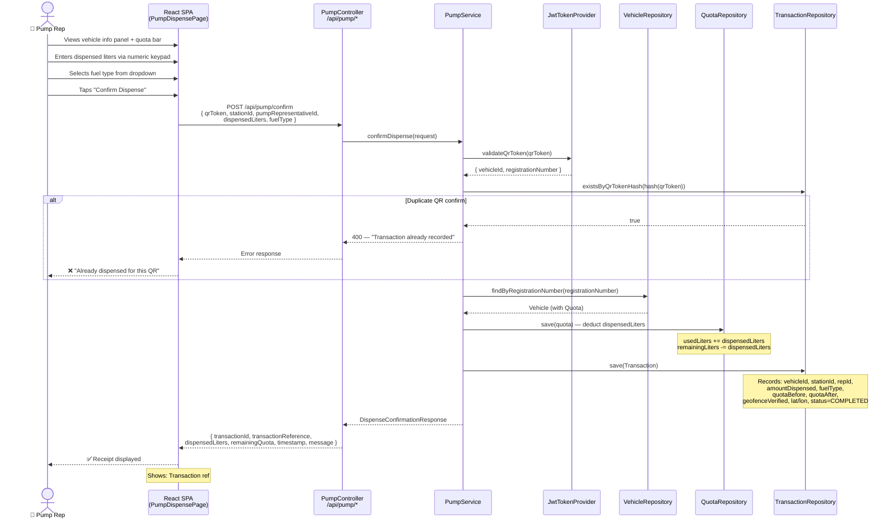
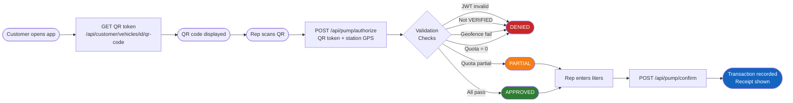

# QR Authorization Flow (Primary Path)

> The primary fuel dispensing sequence using a JWT-based QR token.
> Corresponds to business rules BR-1 through BR-5 and FR-11 through FR-20.

---

## Phase 1 — QR Token Generation (Customer App)

---

## Phase 2 — Pump Rep Login

---

## Phase 3 — QR Scan & Authorization

---

## Phase 4 — Dispense Confirmation

---

## Summary Flow (End-to-End)

