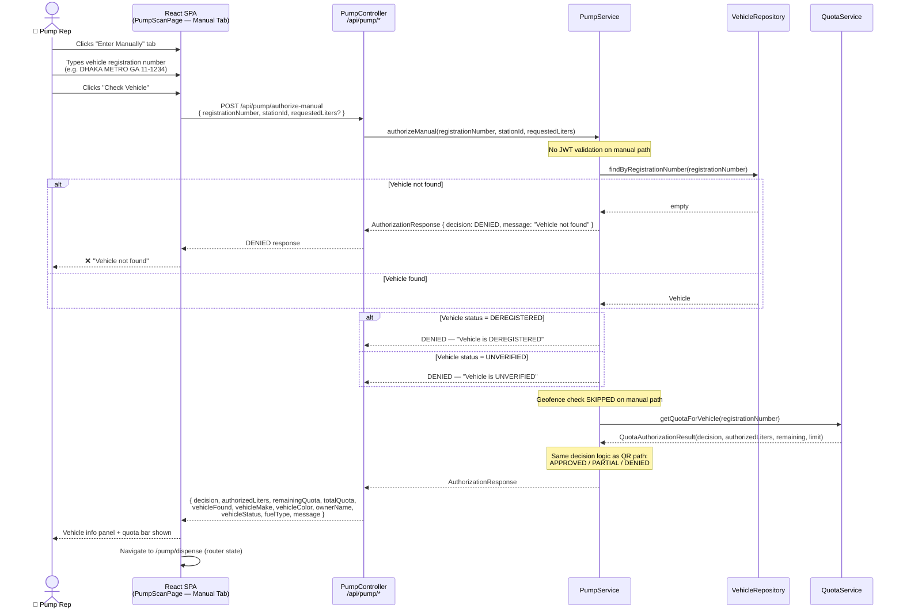
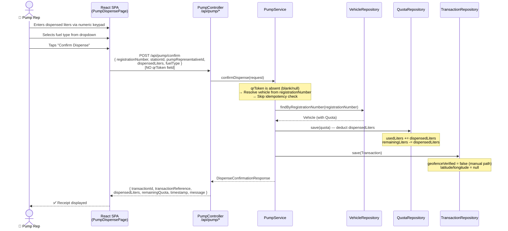
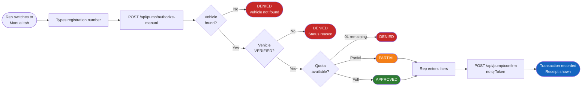

# Manual Authorization Flow (Fallback Path)

> The fallback fuel dispensing sequence when the customer's QR code is unavailable
> (e.g. dead phone battery). The pump rep enters the vehicle registration number directly.
> Corresponds to BR-9, FR-14, FR-18, FR-19 (manual path).

---

## Key Differences vs QR Path

| Aspect | QR Path | Manual Path |
|--------|---------|-------------|
| Token validation | Required (JWT, 1-hour TTL) | Not required |
| Geofence check | Performed when GPS provided | **Skipped** |
| Idempotency | QR token hash checked | **Not checked** (rep responsibility) |
| Vehicle resolution | From JWT claims | From `registrationNumber` field |
| Endpoint | `POST /api/pump/authorize` | `POST /api/pump/authorize-manual` |
| Confirm payload | `qrToken` present | `registrationNumber` present, no `qrToken` |

---

## Authorization Sequence

---

## Dispense Confirmation (Manual Path)

---

## Summary Flow

