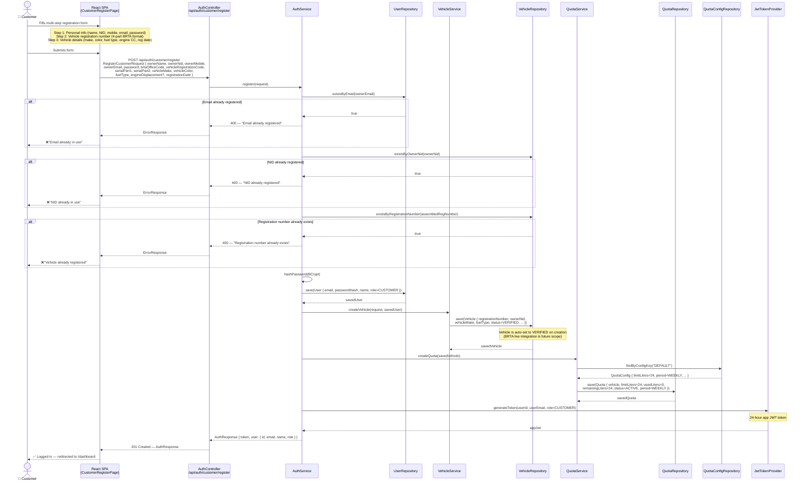
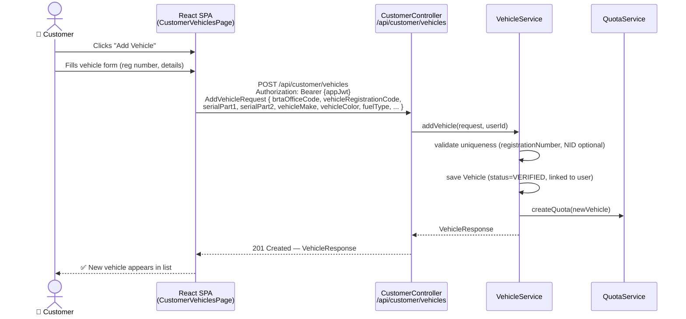
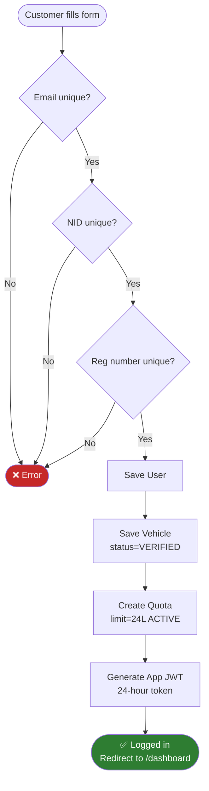

# Customer Registration & Vehicle Onboarding Flow

> New customer self-registration with vehicle details, resulting in a verified vehicle
> record, an active quota, and a JWT session token.
> Corresponds to FR-01, FR-02, BR-7, ATS-09.

---

## Full Registration Sequence

---

## Add Additional Vehicle (Existing Customer)

---

## Registration Form Validation Rules

| Field | Validation |
|-------|-----------|
| `ownerName` | Required, max 100 chars |
| `ownerNid` | Required, max 20 chars, must be unique |
| `ownerEmail` | Required, valid email format, must be unique |
| `password` | Required, minimum 8 characters |
| `brtaOfficeCode` | Required, must exist in `BRTA_OFFICE` reference data |
| `vehicleRegistrationCode` | Required, must exist in `REGISTRATION_CODE` reference data |
| `serialPart1` | Required, numeric |
| `serialPart2` | Required, numeric |
| `vehicleMake` | Required, max 50 chars |
| `vehicleColor` | Required, max 30 chars |
| `fuelType` | Required (Petrol / Diesel / CNG / LPG / Electric) |
| `registrationDate` | Required, valid date, not future |

---

## Summary Flow

