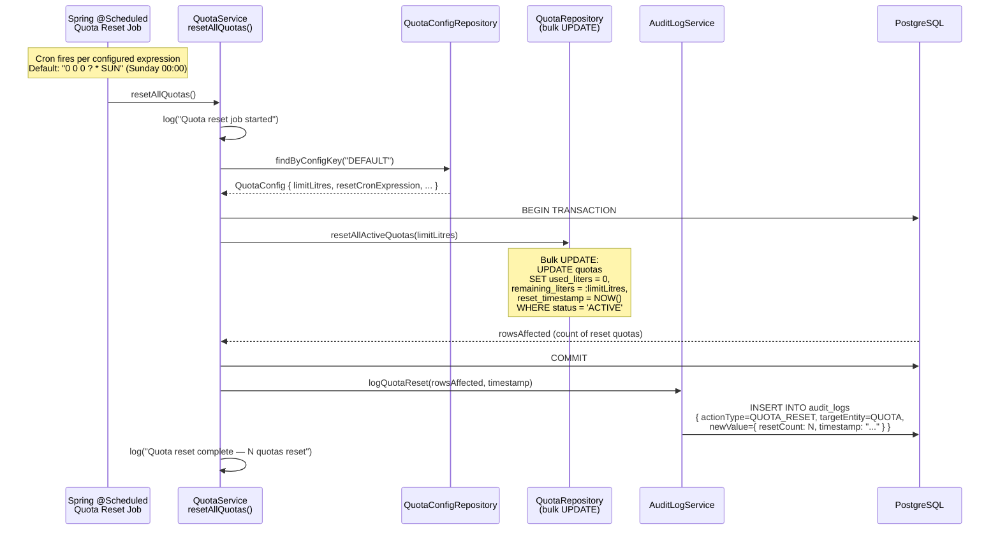
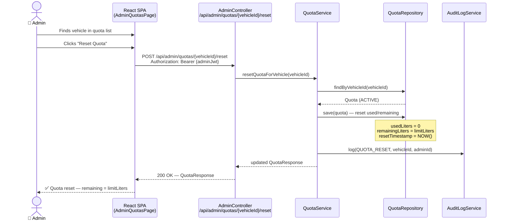
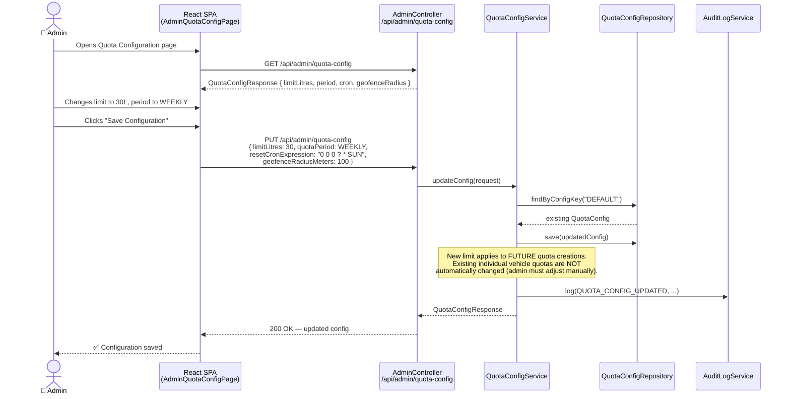

# Scheduled Quota Reset Flow

> The automated periodic quota reset job that zeroes all used-litre counters.
> Triggered by a configurable Spring cron expression.
> Corresponds to BR-4, FR-31, NFR-09, ATS-06.

---

## Scheduled Reset Sequence



---

## Manual Per-Vehicle Reset (Admin Portal)



---

## Quota Configuration Flow (Admin Changes Settings)



---

## Summary Flow

```mermaid
flowchart TD
    A([Cron fires\ne.g. Sunday 00:00]) --> B[QuotaService.resetAllQuotas]
    B --> C[Bulk UPDATE quotas\nused=0, remaining=limit]
    C --> D[Write audit log\nQUOTA_RESET]
    D --> E([All quotas reset\nSystem ready for new period])

    G([Admin manually resets\nindividual vehicle]) --> H[POST /api/admin/quotas/id/reset]
    H --> C2[UPDATE single quota\nused=0]
    C2 --> D2[Write audit log]
    D2 --> F2([Quota reset for that vehicle])

    style F fill:#2e7d32,color:#fff
    style F2 fill:#2e7d32,color:#fff
 ```
