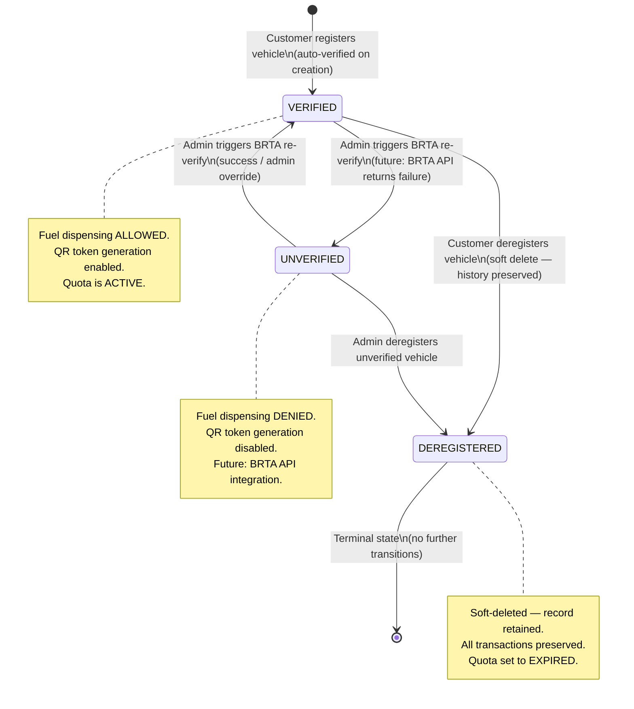
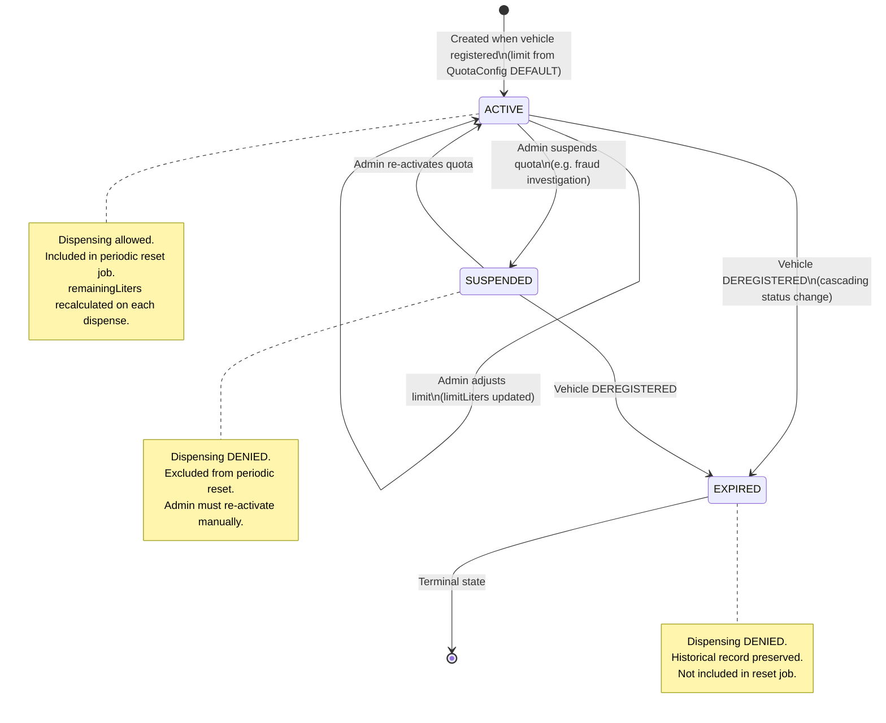
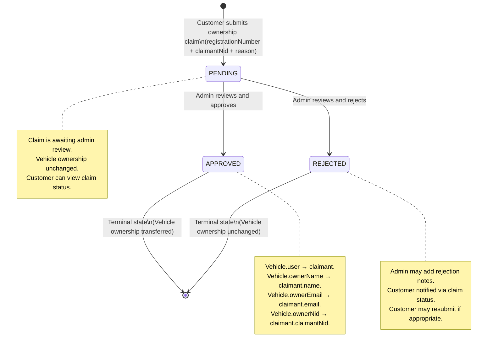
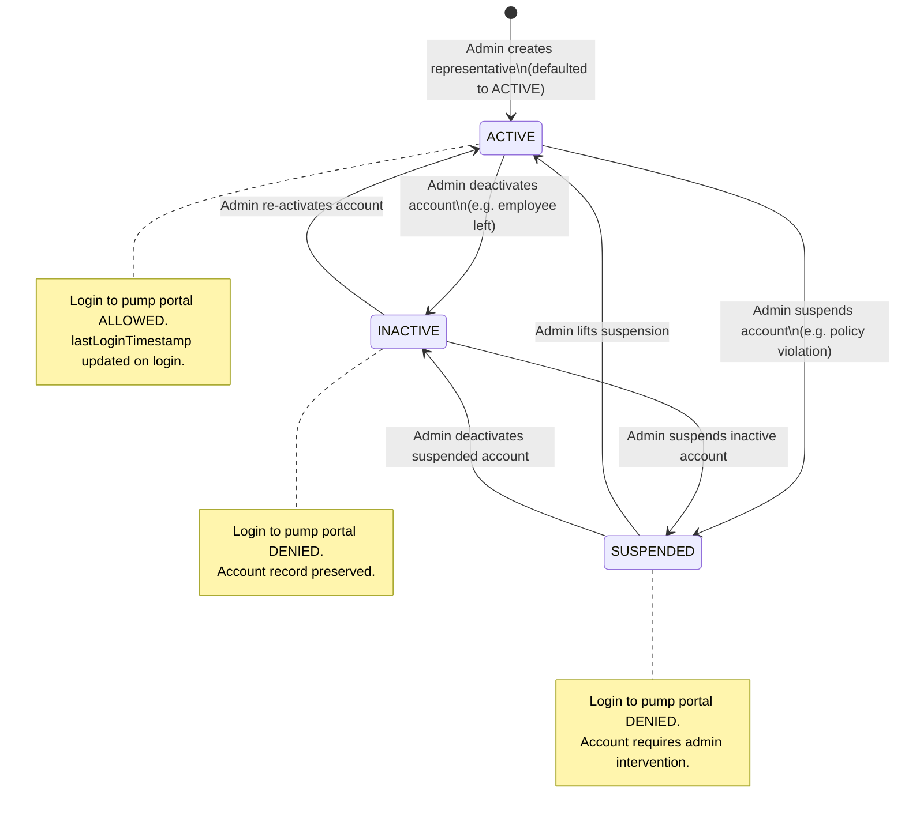
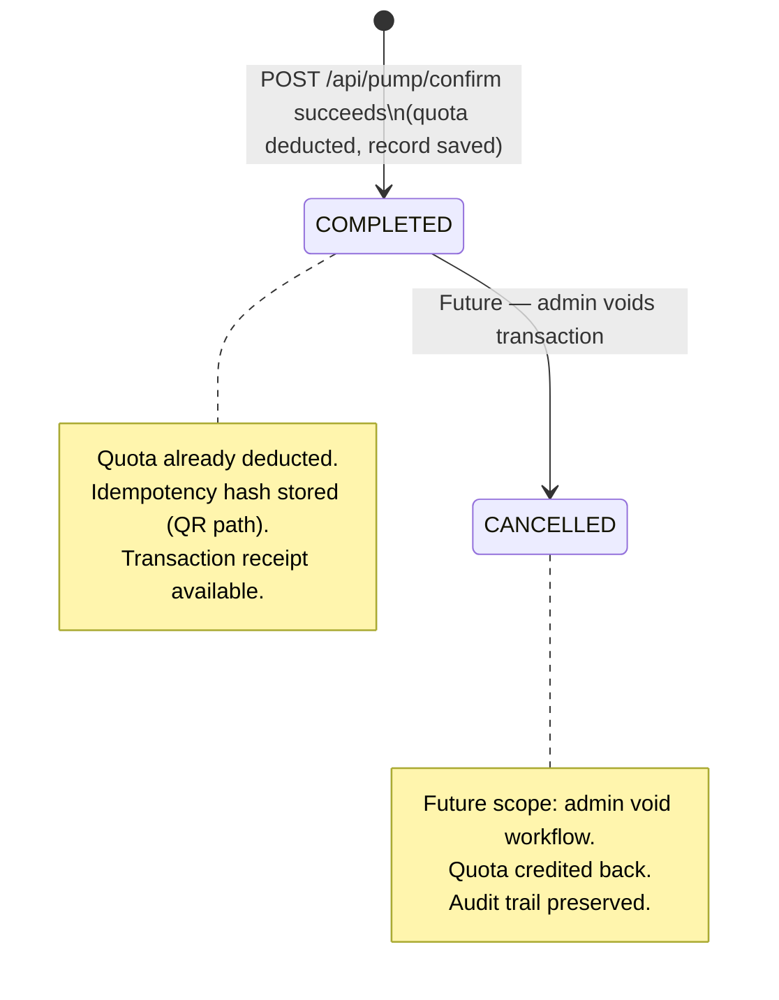
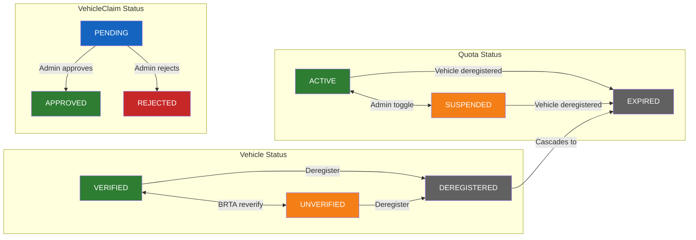

# State Diagrams

> Lifecycle state machines for the four key domain entities:
> Vehicle, Quota, VehicleClaim, and PumpRepresentative.

---

## 1. Vehicle Lifecycle

---

## 2. Quota Lifecycle

---

## 3. VehicleClaim (Ownership Transfer) Workflow

---

## 4. PumpRepresentative Account Status

---

## 5. Transaction Status

---

## Combined State Overview

