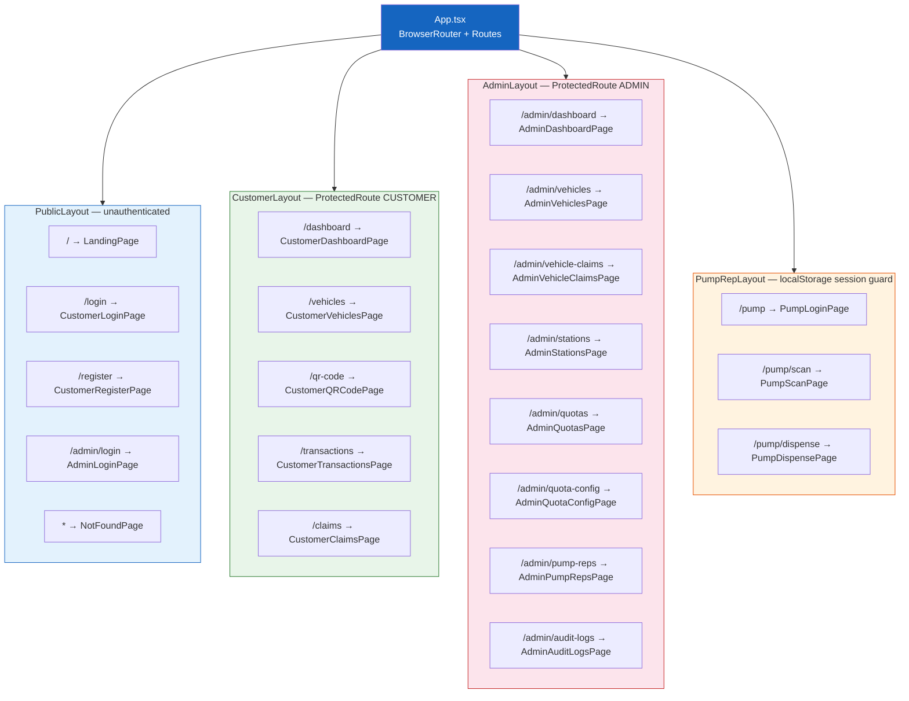
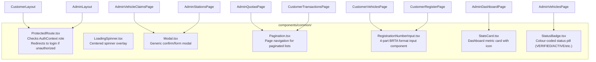
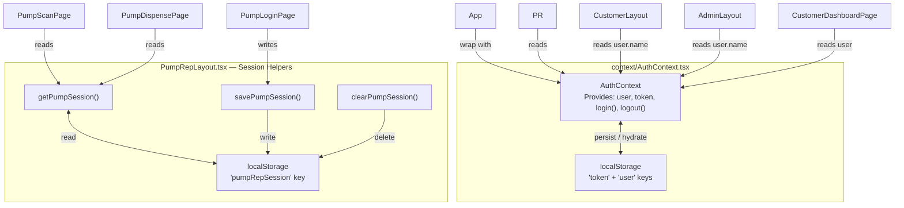
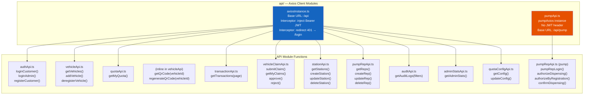
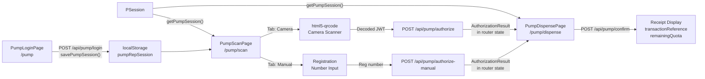

# Frontend Component Diagram

> React 18 SPA structure — layouts, routing, pages, shared components, and API clients.

---

## Routing & Layout Hierarchy

---

## Shared Components

---

## Authentication Context & State

---

## API Client Layer

---

## Pump Portal Data Flow

