# Use Case Diagram

> Actor–use case relationships for all user roles in the Automated Fuel Quota Management System.

---

## All Actors & Use Cases

```mermaid
graph LR
    %% Actors
    Customer(["🧑 Customer\n(Vehicle Owner)"])
    PumpRep(["🔧 Pump Representative"])
    Admin(["👤 System Administrator"])
    System(["⚙️ System\n(Automated)"])

    %% Customer Use Cases
    subgraph CustomerUC["Customer Portal Use Cases"]
        UC01["UC-01: Register Account\n+ Vehicle"]
        UC02["UC-02: Login"]
        UC03["UC-03: View Dashboard\n& Quota Status"]
        UC04["UC-04: Add Vehicle"]
        UC05["UC-05: Deregister Vehicle"]
        UC06["UC-06: Generate QR Token"]
        UC07["UC-07: Regenerate QR Token"]
        UC08["UC-08: View Transaction\nHistory"]
        UC09["UC-09: Submit Ownership\nClaim"]
        UC10["UC-10: View Claim Status"]
    end

    %% Pump Rep Use Cases
    subgraph PumpUC["Pump Representative Portal Use Cases"]
        UC11["UC-11: Login with Employee ID"]
        UC12["UC-12: Scan Customer QR Code"]
        UC13["UC-13: Manual Registration\nNumber Lookup"]
        UC14["UC-14: View Authorization\nResult & Vehicle Info"]
        UC15["UC-15: Enter Dispensed\nAmount (Keypad)"]
        UC16["UC-16: Select Fuel Type"]
        UC17["UC-17: Confirm Dispense"]
        UC18["UC-18: View Transaction\nReceipt"]
    end

    %% Admin Use Cases
    subgraph AdminUC["Admin Portal Use Cases"]
        UC21["UC-21: View / Search Vehicles"]
        UC22["UC-22: Trigger BRTA\nRe-verification"]
        UC23["UC-23: Manage Fuel Stations\n(CRUD + GPS)"]
        UC24["UC-24: Manage Pump Reps\n(CRUD)"]
        UC25["UC-25: Adjust Vehicle Quota"]
        UC26["UC-26: Manually Reset\nVehicle Quota"]
        UC27["UC-27: Configure Global\nQuota Settings"]
        UC28["UC-28: Review & Approve\nOwnership Claims"]
        UC29["UC-29: View Audit Logs"]
        UC30["UC-30: View Dashboard\nStatistics"]
    end

    %% System Use Cases
    subgraph SystemUC["Automated System Use Cases"]
        UC31["UC-31: Periodic Quota Reset\n(Cron Job)"]
        UC33["UC-33: Record Transaction\n& Quota Snapshot"]
        UC34["UC-34: Write Audit Log\nEntry"]
        UC35["UC-35: Validate JWT / QR\nToken"]
        UC36["UC-36: Geofence Check\n(Haversine)"]
    end

    %% Actor → Use Case associations
    Customer --> UC01
    Customer --> UC02
    Customer --> UC03
    Customer --> UC04
    Customer --> UC05
    Customer --> UC06
    Customer --> UC07
    Customer --> UC08
    Customer --> UC09
    Customer --> UC10

    PumpRep --> UC11
    PumpRep --> UC12
    PumpRep --> UC13
    PumpRep --> UC14
    PumpRep --> UC15
    PumpRep --> UC16
    PumpRep --> UC17
    PumpRep --> UC18

    Admin --> UC21
    Admin --> UC22
    Admin --> UC23
    Admin --> UC24
    Admin --> UC25
    Admin --> UC26
    Admin --> UC27
    Admin --> UC28
    Admin --> UC29
    Admin --> UC30

    System --> UC31
    System --> UC32
    System --> UC33
    System --> UC34
    System --> UC35
    System --> UC36

    style Customer fill:#1565c0,color:#fff,rx:30
    style PumpRep fill:#e65100,color:#fff,rx:30
    style Admin fill:#c62828,color:#fff,rx:30
    style System fill:#37474f,color:#fff,rx:30
```

---

## Primary Business Flows (Use Case Groups)

```mermaid
graph TD
    subgraph Flow1["Flow 1: Vehicle Registration"]
        UC01 --> UC06
        UC06 --> UC03
    end

    subgraph Flow2["Flow 2: Fuel Dispensing — QR Path"]
        P1["Customer: UC-06 Generate QR"] --> P2["Rep: UC-11 Login"]
        P2 --> P3["Rep: UC-12 Scan QR"]
        P3 --> P4["System: UC-35 Validate JWT"]
        P4 --> P5["System: UC-36 Geofence Check"]
        P5 --> P6["Rep: UC-14 View Auth Result"]
        P6 --> P7["Rep: UC-15+16+17 Enter & Confirm"]
        P7 --> P8["System: UC-33 Record Transaction"]
        P8 --> P9["Rep: UC-18 View Receipt"]
    end

    subgraph Flow3["Flow 3: Fuel Dispensing — Manual Path"]
        M1["Rep: UC-11 Login"] --> M2["Rep: UC-13 Manual Lookup"]
        M2 --> M3["Rep: UC-14 View Auth Result"]
        M3 --> M4["Rep: UC-15+16+17 Enter & Confirm"]
        M4 --> M5["System: UC-33 Record Transaction"]
    end

    subgraph Flow4["Flow 4: Ownership Transfer"]
        O1["Customer: UC-09 Submit Claim"] --> O2["Admin: UC-28 Review Claim"]
        O2 --> O3["System: UC-34 Audit Log"]
        O3 --> O4["Customer: UC-10 View Status"]
    end

    subgraph Flow5["Flow 5: Quota Reset"]
        R1["System: UC-31 Cron Fires"] --> R2["System: Bulk DB Reset"]
        R2 --> R3["System: UC-34 Audit Log"]
    end
```

---

## Use Case — Functional Requirements Traceability

| Use Case | FR | BRD Business Rule |
|----------|----|--------------------|
| UC-01 Register Account | FR-01, FR-02 | BR-7 |
| UC-06 Generate QR Token | FR-06 | BR-5 |
| UC-11 Rep Login | FR-11 | BR-8 |
| UC-12 Scan QR | FR-13 | BR-5 |
| UC-13 Manual Lookup | FR-14 | BR-9 |
| UC-17 Confirm Dispense | FR-18 | BR-1, BR-2, BR-3 |
| UC-25 Adjust Quota | FR-25 | BR-1 |
| UC-27 Configure Quota | FR-27 | BR-1 |
| UC-28 Review Claims | FR-28 | BR-6 |
| UC-31 Quota Reset | FR-31 | BR-4 |
| UC-33 Record Transaction | FR-32 | — |
| UC-34 Audit Log | FR-33 | — |

