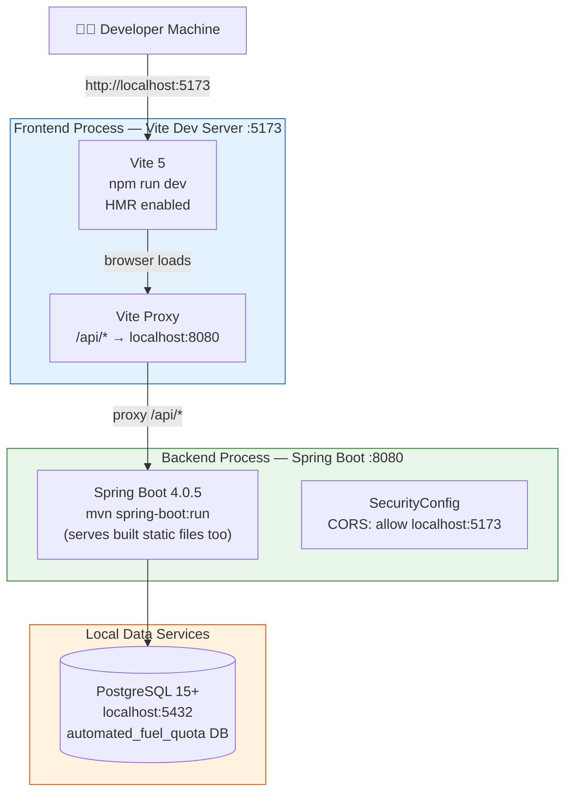
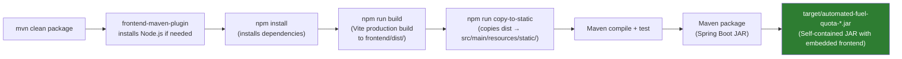
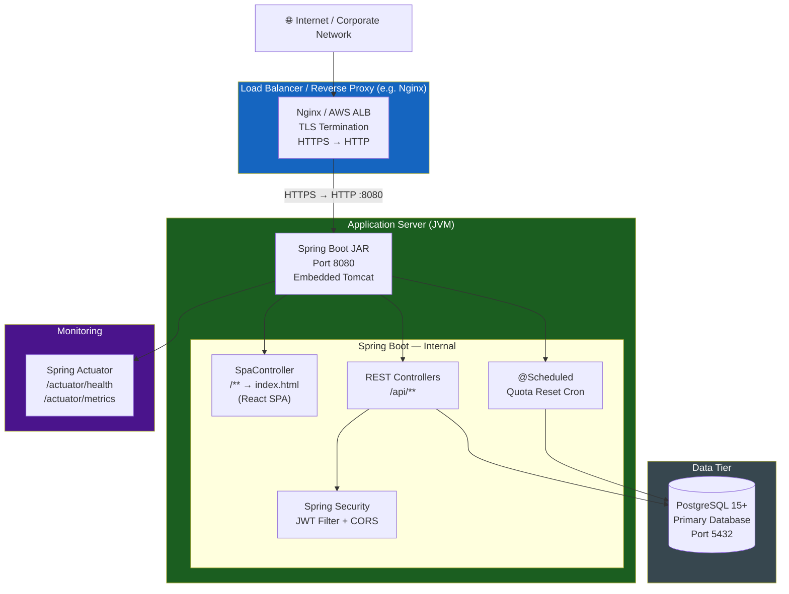
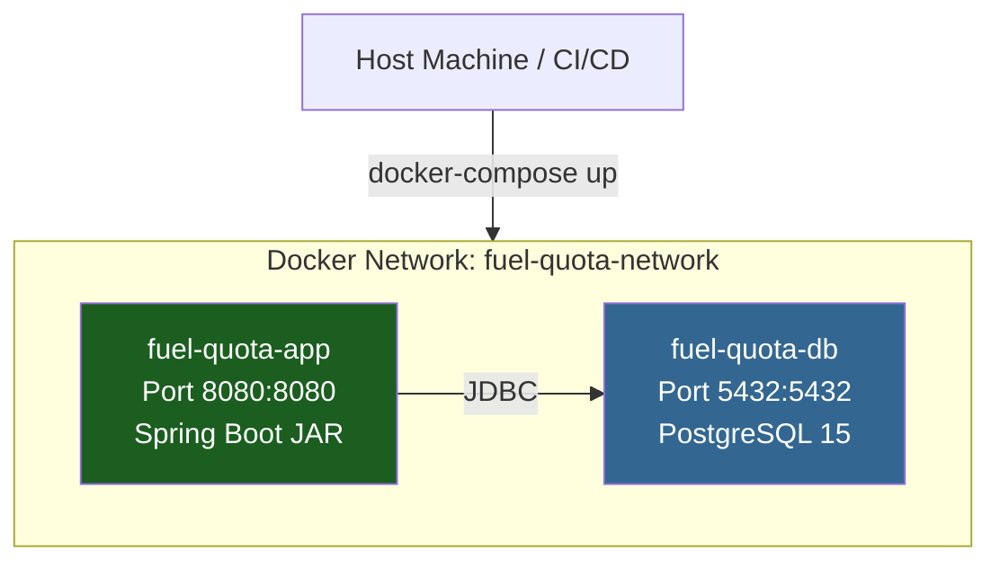

# Deployment Architecture

> Development and production deployment topologies for the Automated Fuel Quota Management System.

---

## Development Topology

> Two separate processes communicate over localhost. Hot Module Replacement (HMR)
> is active in the frontend; API requests are proxied to the backend.



### Development Commands

```bash
# Start backend (API only — no frontend hot reload)
mvn spring-boot:run

# Start frontend (hot reload — proxies API to :8080)
cd frontend && npm run dev

# Both together in separate terminals
# Frontend: http://localhost:5173
# API:       http://localhost:8080/api
```

---

## Production Build Pipeline

> The Maven build orchestrates the full-stack production build via `frontend-maven-plugin`.



---

## Production Runtime Topology

> Single JAR serves both the API and the React SPA as static files.
> All traffic enters through port 8080.



### Production Run Command

```bash
# Start with production profile
java -jar target/automated-fuel-quota-0.0.1-SNAPSHOT.jar \
  --spring.profiles.active=prod \
  --spring.datasource.url=jdbc:postgresql://<host>:5432/automated_fuel_quota \
  --spring.datasource.username=<user> \
  --spring.datasource.password=<pass> \
  --app.jwt.secret=<256-bit-secret>
```

---

## Container / Docker Topology (Example)



---

## Required External Dependencies

| Service | Version | Role | Optional? |
|---------|---------|------|-----------|
| PostgreSQL | 15+ | Primary database | ❌ Required |
| JVM | Java 25 | Runtime | ❌ Required |
| Node.js | 20+ | Build only (not runtime) | ❌ Required for build |

---

## Monitoring Endpoints

| Endpoint | Description |
|----------|-------------|
| `GET /actuator/health` | Overall health (DB connectivity) |
| `GET /actuator/metrics` | JVM heap, GC, HTTP request rates |
| `GET /actuator/info` | Build version and artifact metadata |
| `GET /api/pump/health` | Pump API liveness check |

